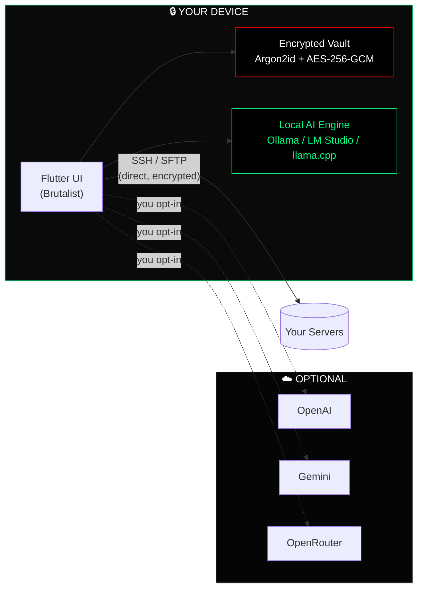

<div align="center">

# 🛡️ HAMMA

### **Manage your servers without writing commands.**

*A brutalist, AI-powered SSH client for Linux, Windows, macOS, Android & iOS — built in Flutter.*

<br/>

[]()
[]()
[]()
[]()
[]()

<br/>

```
╔══════════════════════════════════════════════════════════════╗
║   YOUR FLEET. YOUR KEYS. YOUR AI. NOTHING LEAVES YOUR DEVICE. ║
╚══════════════════════════════════════════════════════════════╝
```

</div>

---

## 🌟 What is Hamma?

**Hamma** is a comprehensive DevOps command center that fits in your pocket *and* on your desktop. It bridges raw terminal complexity and modern UX with a **safety-first AI layer** that explains logs, suggests fixes, and orchestrates your fleet — all while keeping every byte of your data local.

> **No proxy. No telemetry of your commands. No AI prompts shipped to a third party (unless *you* configure that).**

---

## ⚡ Feature Grid

<table>
<tr>
<td width="50%" valign="top">

### 🧠 AI Copilot
- **Local-first AI** via Ollama, LM Studio, llama.cpp & Jan
- **Cloud AI** (OpenAI · Gemini · OpenRouter) optional
- **Streaming** token-by-token replies
- **Risk Assessor** flags destructive commands before run
- **One-tap error analysis** on SSH failures

</td>
<td width="50%" valign="top">

### 🔐 Security & Privacy
- **Zero-Proxy:** direct encrypted SSH tunnels
- **Zero-Trust Local AI:** loopback-only, runtime-enforced
- **App PIN + Biometrics** unlock the encrypted vault
- **Argon2id + AES-256-GCM** encrypted backups
- **Trusted host-key pinning** out of the box

</td>
</tr>
<tr>
<td width="50%" valign="top">

### 🖥️ Mobile-Optimized Terminal
- `xterm.dart` powered, 256-color, Unicode-safe
- Custom keyboard row (Ctrl, Tab, arrows, pipe, ~, …)
- Full SSH agent + key auth
- Reconnect-on-wake, persistent sessions

</td>
<td width="50%" valign="top">

### 📁 Visual SFTP
- Browse, edit, upload, download, chmod
- In-app editor with syntax highlighting
- Automatic **`sudo` fallback** on permission denied
- Drag-to-reorder, multi-select bulk ops

</td>
</tr>
<tr>
<td width="50%" valign="top">

### 🐳 Docker & Service Control
- List / start / stop / restart containers
- Live `docker logs -f` streaming
- `systemd` service manager
- Process viewer (CPU / RAM per PID)

</td>
<td width="50%" valign="top">

### 🌐 Fleet & Networking
- Unified dashboard for every server
- Live health metrics & uptime
- SSH port forwarding from your phone
- Encrypted backup sync (Local · SFTP · WebDAV · Syncthing)

</td>
</tr>
</table>

---

## 🏛️ Architecture at a Glance



---

## 🤖 First-Class Local AI

Hamma treats **local inference as a first-class citizen** — not an afterthought.

| Capability | Status |
|---|---|
| Auto-detect local engines on standard ports | ✅ Ollama · LM Studio · llama.cpp · Jan |
| In-app model manager (pull / delete / set default) | ✅ Streaming progress, byte-accurate |
| Streaming chat replies (token-by-token) | ✅ SSE + NDJSON |
| Real-time engine health pill | ✅ `ONLINE · {model}` / `LOADING` / `OFFLINE` |
| 3-step onboarding wizard with OS-aware snippets | ✅ macOS · Linux · Windows |
| Loopback-only enforcement | ✅ Tested *and* hard-guarded at runtime |

**Quick start with Ollama:**
```bash
ollama serve            # start the engine
ollama pull gemma3      # download a model (~5 GB)
```
Open Hamma → **Settings → AI → Local AI → FIRST-RUN SETUP** and you're talking to a local model in under 60 seconds.

---

## 🚀 Getting Started

### 👤 For Users

```text
1.  Launch Hamma
2.  Set your App PIN  →  Settings → Security
3.  Choose AI provider →  Settings → AI Configuration
4.  Add a server      →  Servers tab → +
5.  Connect           →  Tap server → Open Terminal
```

### 🛠️ For Developers

```bash
# Clone
git clone https://github.com/hamma/hamma.git
cd hamma

# Install Flutter deps
flutter pub get

# Verify
flutter analyze
flutter test

# Run desktop / mobile
flutter run
```

<details>
<summary><b>📦 Linux build (Nix-managed)</b></summary>

```bash
JAVA_HOME="/nix/store/.../openjdk"
PKG_CONFIG_PATH="$SYSPROF_DEV/lib/pkgconfig:$APPINDICATOR_DEV/lib/pkgconfig:$PKG_CONFIG_PATH"
flutter build linux --debug
bash run.sh
```

System deps via Nix: `flutter`, `libsecret`, `keybinder3`, `libappindicator`, `sysprof`, `gtk3`, `glib`, `pcre2`, `jdk17`, `mesa`, `xorg.xorgserver`, `xvfb-run`, `zlib`, `curlFull`.

</details>

---

## 🔒 Security Model

| Layer | Protection |
|---|---|
| 🔑 **Credentials** | `flutter_secure_storage` → Keychain / Keystore / libsecret |
| 💾 **Backups** | Argon2id (m=19 MiB, t=2, p=1) → AES-256-GCM (96-bit IV) |
| 🌐 **SSH transport** | Direct TLS-grade tunnel — *never* proxied |
| 🤖 **Local AI** | Loopback-only (`127.0.0.0/8`, `::1`, `localhost`) — runtime guarded |
| 🛡️ **AI commands** | Risk-scored before display, **never** auto-executed |
| 🔐 **App lock** | PIN + biometrics on every cold launch |

> Every AI suggestion is **reviewed by you** before it touches a remote shell. The "Safety-First" rule is non-negotiable.

---

## 🧰 Tech Stack

<div align="center">

| Layer | Tool |
|:---:|:---:|
| **Framework** | Flutter 3.32 (Dart) |
| **SSH / SFTP** | `dartssh2` |
| **Terminal** | `xterm.dart` |
| **Secure Storage** | `flutter_secure_storage` |
| **AI Streaming** | Native SSE + NDJSON (`HttpClient`) |
| **Local AI** | Ollama / LM Studio / llama.cpp / Jan |
| **Crypto** | Argon2id · AES-256-GCM |
| **Monitoring** | Sentry (opt-in, scrubbed) |

</div>

---

## 🗺️ Roadmap

```
[██████████] PHASE 1   Core SSH + AI integration                ✅ DONE
[██████████] PHASE 2   UI polish + security hardening           ✅ DONE
[██████████] PHASE 3   SFTP, Docker, fleet management           ✅ DONE
[██████████] PHASE 4   First-class Local AI (zero-trust)        ✅ DONE
[░░░░░░░░░░] PHASE 5   Encrypted cloud sync (optional)          ⏳ NEXT
[░░░░░░░░░░] PHASE 6   Multi-language support                   ⏳ PLANNED
[░░░░░░░░░░] PHASE 7   Plugin / extension API                   ⏳ PLANNED
```

---

## 📂 Project Layout

```
hamma/
├── lib/
│   ├── main.dart                  # entry point
│   ├── core/
│   │   ├── ai/                    # providers, ollama_client, detector, health monitor
│   │   ├── ssh/                   # dartssh2 wrappers, state machine
│   │   ├── storage/               # secure storage, prefs, history
│   │   ├── backup/                # Argon2id + AES-256-GCM crypto
│   │   └── theme/                 # brutalist AppColors
│   └── features/
│       ├── ai_assistant/          # AI screen, copilot sheet, status pill
│       ├── terminal/              # xterm.dart UI
│       ├── sftp/                  # file manager + editor
│       ├── docker/                # container manager
│       ├── processes/             # process + service viewer
│       └── settings/              # AI config, local models, onboarding
├── test/                          # 65+ unit tests, zero-trust guards
├── linux/  android/  ios/         # platform shells
└── replit.md                      # architecture notes
```

---

<div align="center">

### Built with ⚡ for engineers who refuse to choose between **power** and **privacy**.

<sub>© Hamma — All rights reserved.</sub>

</div>
