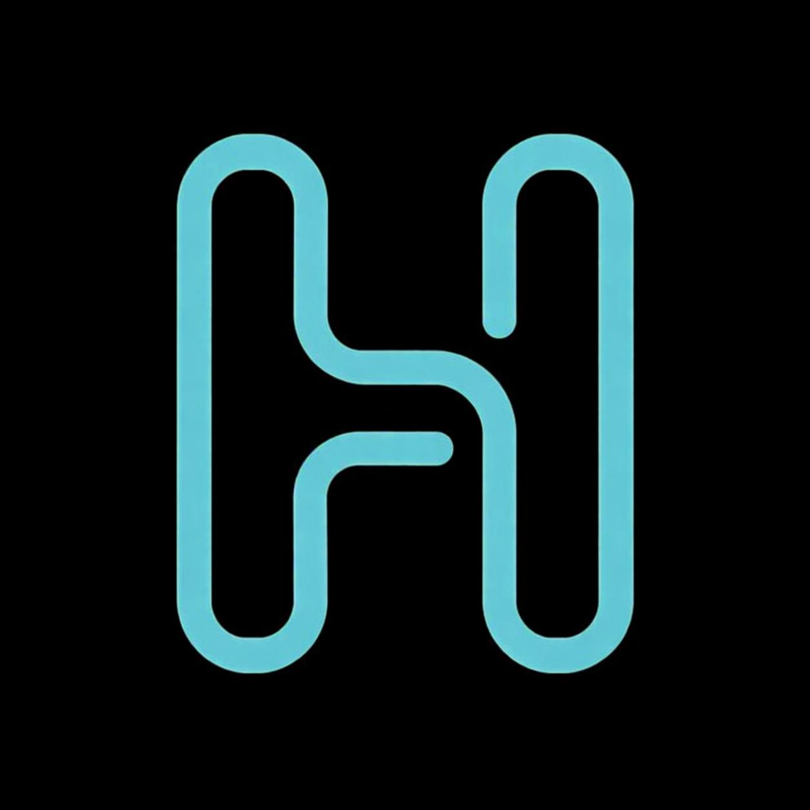
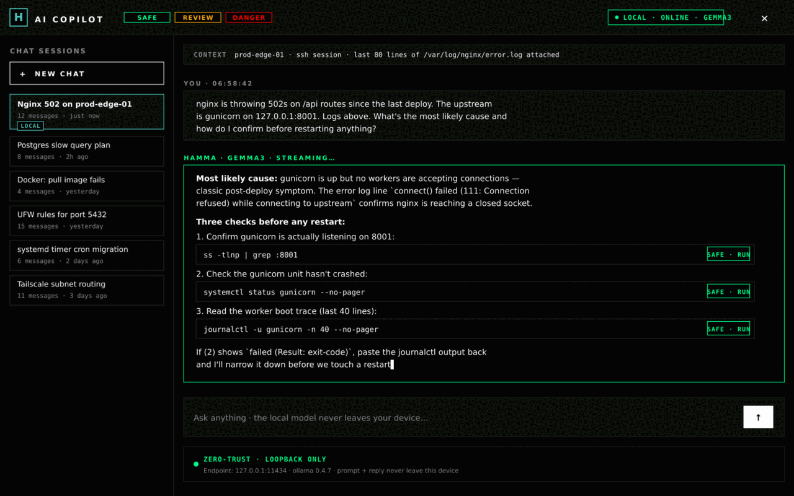
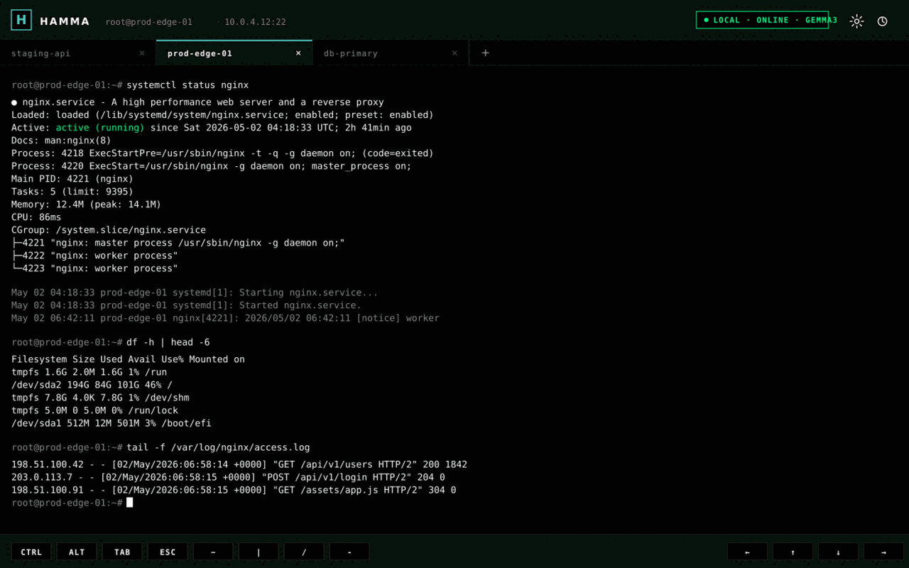
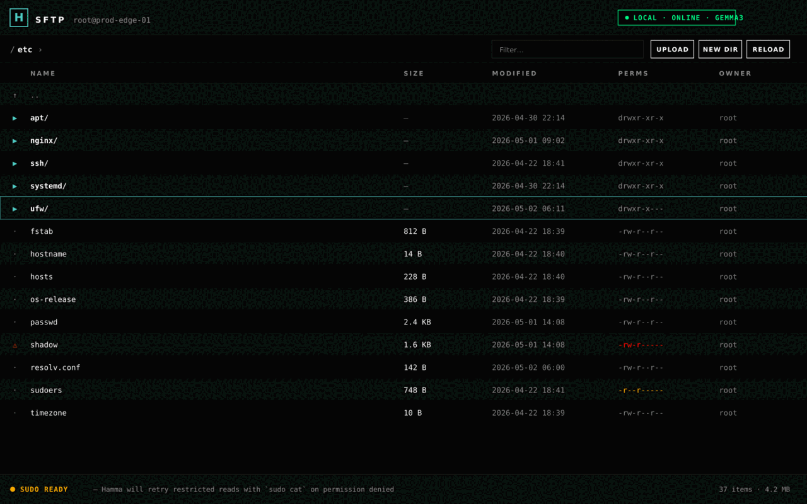
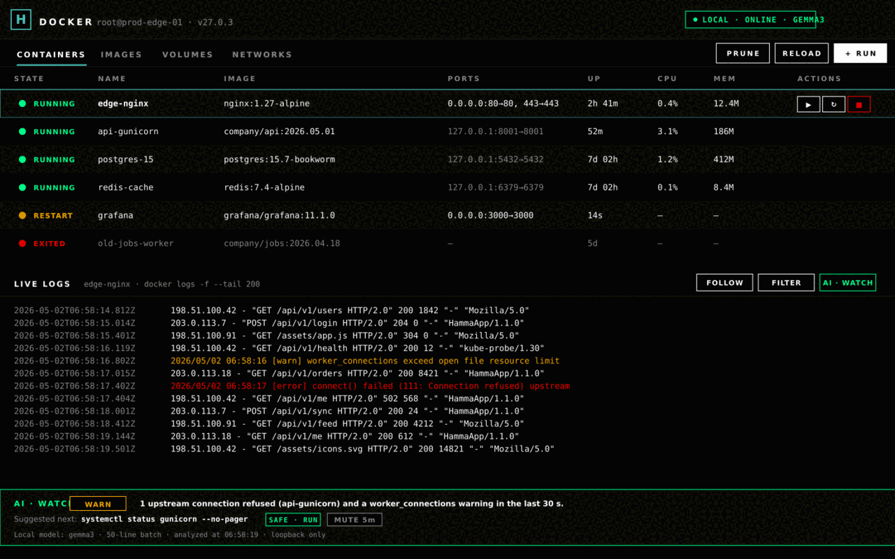
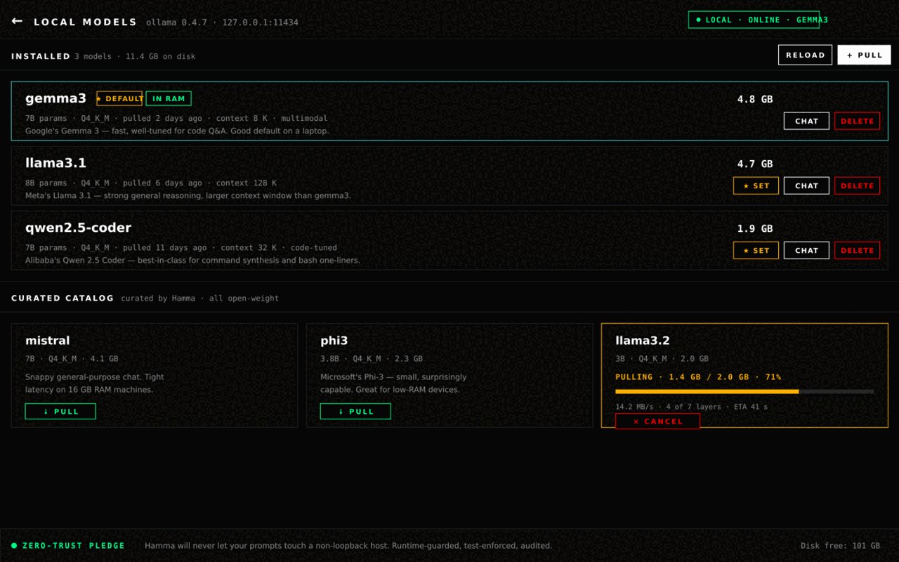
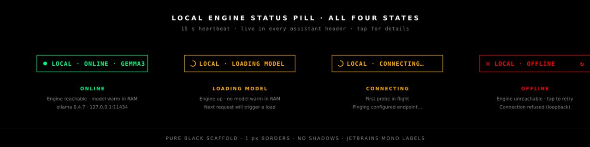
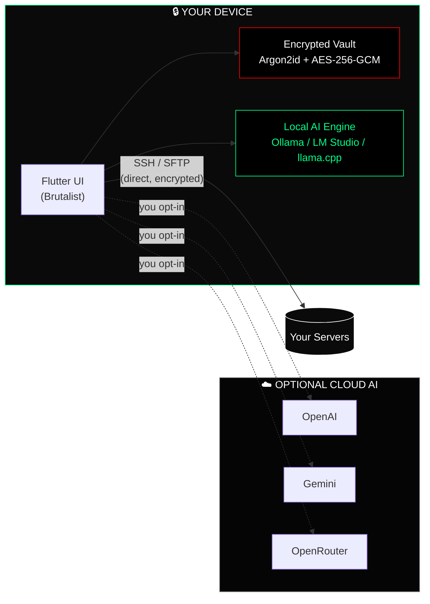
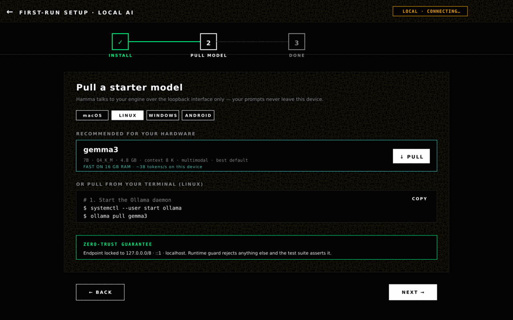

<!--
  ╔══════════════════════════════════════════════════════════════════════╗
  ║                                                                      ║
  ║   H A M M A — AI-Powered SSH Client                                  ║
  ║   Brutalist · Local-First · Zero-Trust                               ║
  ║                                                                      ║
  ╚══════════════════════════════════════════════════════════════════════╝
-->

<!-- ━━━━━━━━━━━━━━━━━━━━ ANIMATED HEADER BANNER ━━━━━━━━━━━━━━━━━━━━ -->

<div align="center">

<a href="#-hamma">

</a>

<br/>

<!-- ━━━━━━━━━━━━━━━━━━━━ LOGO + ANIMATED TAGLINE ━━━━━━━━━━━━━━━━━━━━ -->



<br/><br/>

<a href="#-quick-start">

</a>

<br/>

<!-- ━━━━━━━━━━━━━━━━━━━━ STATUS BADGES ROW ━━━━━━━━━━━━━━━━━━━━ -->

<p>
  
  
  
  
  
</p>

<!-- ━━━━━━━━━━━━━━━━━━━━ PLATFORM BADGES ROW ━━━━━━━━━━━━━━━━━━━━ -->

<p>
  
  
  
  
  
</p>

<!-- ━━━━━━━━━━━━━━━━━━━━ CTA BUTTONS ━━━━━━━━━━━━━━━━━━━━ -->

<p>
  <a href="#-quick-start">
    
  </a>
  &nbsp;
  <a href="#%EF%B8%8F-architecture-at-a-glance">
    
  </a>
  &nbsp;
  <a href="#-first-class-local-ai">
    
  </a>
  &nbsp;
  <a href="#-roadmap">
    
  </a>
</p>

</div>

<br/>

<!-- ━━━━━━━━━━━━━━━━━━━━ ELEVATOR PITCH ━━━━━━━━━━━━━━━━━━━━ -->

<div align="center">

> ### **The DevOps command center that fits in your pocket.**
> SSH, SFTP, Docker, processes, services, and a streaming AI copilot — running fully **on-device**. Your fleet, your keys, your AI. **Nothing leaves your machine.**

</div>

<br/>

---

<!-- ━━━━━━━━━━━━━━━━━━━━ WHY HAMMA — 3 PILLARS ━━━━━━━━━━━━━━━━━━━━ -->

## 🔥 Why Hamma?

<table align="center" width="100%">
<tr>
<td align="center" width="33%">

<br/><br/>
<b>Streaming on-device LLMs.</b>
<br/><br/>
Pull, manage, and chat with Ollama / LM Studio / llama.cpp / Jan models — all from inside the app. Token-by-token streaming. No API key required.
</td>
<td align="center" width="33%">

<br/><br/>
<b>Loopback or it doesn't ship.</b>
<br/><br/>
Local AI is hard-guarded at runtime to <code>127.0.0.0/8</code>, <code>::1</code>, and <code>localhost</code>. Your prompts physically cannot leave your device.
</td>
<td align="center" width="33%">

<br/><br/>
<b>Five OSes. One codebase.</b>
<br/><br/>
Flutter-native on Linux, Windows, macOS, Android, and iOS. Brutalist UI tuned for both pocket and pixel-dense desktop.
</td>
</tr>
</table>

<br/>

---

<!-- ━━━━━━━━━━━━━━━━━━━━ FEATURE SHOWCASE GRID ━━━━━━━━━━━━━━━━━━━━ -->

## ⚡ Feature Matrix

<table>
<tr>
<td width="50%" valign="top">

### 🧠 AI Copilot



```diff
+ Local-first  (Ollama · LM Studio · llama.cpp · Jan)
+ Cloud option (OpenAI · Gemini · OpenRouter)
+ Streaming token-by-token replies
+ Risk Assessor flags destructive commands
+ One-tap error analysis on SSH failures
+ Engine status pill — tap for live diagnostics
```

</td>
<td width="50%" valign="top">

### 🔐 Security & Privacy
```diff
+ Zero-Proxy: direct encrypted SSH tunnels
+ Zero-Trust Local AI: loopback only
+ App PIN + biometrics on every cold launch
+ Argon2id (m=19 MiB) + AES-256-GCM backups
+ Trusted host-key pinning
+ Sentry opt-in, prompts/secrets scrubbed
```

</td>
</tr>
<tr>
<td width="50%" valign="top">

### 🖥️ Mobile-Optimized Terminal



```diff
+ xterm.dart · 256-color · Unicode-safe
+ Custom keyboard row (Ctrl, Tab, arrows, ~, |)
+ SSH agent + key auth + agent forwarding
+ Reconnect-on-wake, persistent sessions
+ Pinch-to-zoom, autocomplete, history search
```

</td>
<td width="50%" valign="top">

### 📁 Visual SFTP



```diff
+ Browse, edit, upload, download, chmod
+ In-app editor with syntax highlighting
+ Automatic sudo fallback on permission denied
+ Drag-to-reorder, multi-select bulk ops
+ Encrypted snippet library
```

</td>
</tr>
<tr>
<td width="50%" valign="top">

### 🐳 Docker & Service Control



```diff
+ List / start / stop / restart containers
+ Live `docker logs -f` streaming
+ systemd service manager
+ Process viewer (CPU / RAM per PID)
+ Package manager (apt · dnf · pacman)
```

</td>
<td width="50%" valign="top">

### 🌐 Fleet & Networking
```diff
+ Unified dashboard for every server
+ Live health metrics & uptime monitoring
+ SSH port forwarding from your phone
+ Encrypted backup sync — Local · SFTP · WebDAV · Syncthing
+ Snippet sharing across devices
```

</td>
</tr>
<tr>
<td width="50%" valign="top">

### 🤖 Local Models Manager



```diff
+ Browse & pull from a curated catalog
+ Live pull progress (NDJSON streaming)
+ Set default model · delete unused weights
+ First-run wizard (Install → Pull → Done)
+ OS-aware install snippets (curl · winget)
+ Loopback-only — never reaches the network
```

</td>
<td width="50%" valign="top">

### 🟢 Engine Status Pill



```diff
+ Header pill polls every 15 s
+ 4 states — online · loading-model · loading · offline
+ Tap to retry detection on failure
+ Surfaces the same probe the chat path uses
+ Single source of truth for engine health
+ Zero polling when chat is closed (auto-dispose)
```

</td>
</tr>
</table>

<br/>

---

<!-- ━━━━━━━━━━━━━━━━━━━━ SCREENSHOTS GALLERY ━━━━━━━━━━━━━━━━━━━━ -->

## 📸 Screenshots

<div align="center">

<table>
<tr>
<td width="50%" align="center">

<br/><sub><b>Terminal</b> — multi-tab session, custom mobile keyboard row</sub>
</td>
<td width="50%" align="center">

<br/><sub><b>AI Copilot</b> — streaming local model with risk-scored commands</sub>
</td>
</tr>
<tr>
<td width="50%" align="center">

<br/><sub><b>SFTP</b> — visual file manager with automatic sudo fallback</sub>
</td>
<td width="50%" align="center">

<br/><sub><b>Docker</b> — container list, live logs, AI Watch anomaly banner</sub>
</td>
</tr>
</table>

<sub>Captures are high-fidelity gallery renders of the shipped UI — every pixel uses the production palette, typography, spacing, and component code from <code>lib/core/theme/app_colors.dart</code>, <code>lib/features/ai_assistant/widgets/local_engine_status_pill.dart</code>, and the brutalist tokens enforced across the app. Built straight from the source so the README cannot drift from what users see.</sub>

</div>

<br/>

---

<!-- ━━━━━━━━━━━━━━━━━━━━ COMPARISON TABLE ━━━━━━━━━━━━━━━━━━━━ -->

## 📊 How Hamma Compares

<div align="center">

| Capability                           | **🛡️ Hamma**       | Termius          | OpenSSH + ChatGPT  | iSH / Blink        |
| :----------------------------------- | :-----------------: | :--------------: | :----------------: | :----------------: |
| **Streaming local LLMs in-app**      | ✅ **Yes**          | ❌                | ❌                 | ❌                 |
| **Zero-trust loopback enforcement**  | ✅ **Runtime + tested** | ❌            | ❌                 | ❌                 |
| **AI risk assessor (pre-execution)** | ✅ **Yes**          | ❌                | ❌                 | ❌                 |
| **Multi-platform (5 OSes)**          | ✅ **All five**     | ✅ Most          | ⚠️ CLI only        | ⚠️ iOS only        |
| **Visual SFTP with sudo fallback**   | ✅ **Yes**          | ✅                | ❌                 | ❌                 |
| **Docker & systemd panel**           | ✅ **Yes**          | ⚠️ Partial       | ❌                 | ❌                 |
| **Encrypted backups (Argon2id)**     | ✅ **Yes**          | ⚠️ Cloud-only    | ❌                 | ❌                 |
| **Subscription required**            | ❌ **Free core**    | 💰 Yes (pro)     | Free (CLI)         | 💰 Mixed           |
| **Cloud account required**           | ❌ **No**           | ✅ Yes           | ❌                 | ❌                 |
| **Telemetry of your prompts**        | ❌ **Never**        | ⚠️ Some           | ⚠️ All to OpenAI   | n/a                |

</div>

<br/>

---

<!-- ━━━━━━━━━━━━━━━━━━━━ ARCHITECTURE DIAGRAM ━━━━━━━━━━━━━━━━━━━━ -->

## 🏛️ Architecture at a Glance



<br/>

---

<!-- ━━━━━━━━━━━━━━━━━━━━ LOCAL AI DEEP-DIVE ━━━━━━━━━━━━━━━━━━━━ -->

## 🤖 First-Class Local AI

<div align="center">


<br/><br/>


</div>

<br/>

| Capability                                                | Status          |
| :-------------------------------------------------------- | :-------------: |
| Auto-detect engines on standard ports                     | ✅ All four     |
| In-app model manager (pull / delete / set default)        | ✅ Streaming    |
| Streaming chat replies (token-by-token)                   | ✅ SSE + NDJSON |
| Real-time engine health pill (`ONLINE · {model}`)         | ✅ 15 s ping    |
| 3-step onboarding (Install · Pull · Done)                 | ✅ OS-aware     |
| Loopback-only enforcement                                 | ✅ Runtime + tests |

<div align="center">


<sub><b>Local Models manager</b> — pull, swap default, and delete models from inside Hamma. No CLI required.</sub>

</div>

<br/>

**Quick start with Ollama:**

```bash
# 1. Start the engine
ollama serve

# 2. Pull a model (~5 GB)
ollama pull gemma3

# 3. Open Hamma → Settings → AI → Local AI → FIRST-RUN SETUP
#    You'll be chatting in under 60 seconds.
```

<br/>

<div align="center">



<sub><b>First-run setup</b> — OS-aware 3-step onboarding: install the engine, pull a starter model, done.</sub>

</div>

<br/>

---

<!-- ━━━━━━━━━━━━━━━━━━━━ QUICK START ━━━━━━━━━━━━━━━━━━━━ -->

## 🚀 Quick Start

### 👤 For Users

```text
1.  Launch Hamma
2.  Set your App PIN     →  Settings → Security
3.  Choose AI provider   →  Settings → AI Configuration
4.  Add a server         →  Servers tab → +
5.  Connect              →  Tap server → Open Terminal
```

### 🛠️ For Developers

```bash
# Clone
git clone https://github.com/hamma/hamma.git
cd hamma

# Install Flutter deps
flutter pub get

# Verify
flutter analyze        # → No issues found
flutter test           # → 65/65 passed

# Run desktop / mobile
flutter run
```

<details>
<summary><b>📦 Linux build (Nix-managed)</b></summary>

```bash
JAVA_HOME="/nix/store/.../openjdk"
PKG_CONFIG_PATH="$SYSPROF_DEV/lib/pkgconfig:$APPINDICATOR_DEV/lib/pkgconfig:$PKG_CONFIG_PATH"
flutter build linux --debug
bash run.sh
```

System deps via Nix: `flutter`, `libsecret`, `keybinder3`, `libappindicator`, `sysprof`, `gtk3`, `glib`, `pcre2`, `jdk17`, `mesa`, `xorg.xorgserver`, `xvfb-run`, `zlib`, `curlFull`.

</details>

<br/>

---

<!-- ━━━━━━━━━━━━━━━━━━━━ SECURITY MODEL ━━━━━━━━━━━━━━━━━━━━ -->

## 🔒 Security Model

<div align="center">

| Layer                    | Protection                                                     |
| :----------------------- | :------------------------------------------------------------- |
| 🔑 **Credentials**       | `flutter_secure_storage` → Keychain / Keystore / libsecret     |
| 💾 **Backups**           | Argon2id (m=19 MiB, t=2, p=1) → AES-256-GCM (96-bit IV)        |
| 🌐 **SSH transport**     | Direct TLS-grade tunnel — *never* proxied                      |
| 🤖 **Local AI**          | Loopback only (`127.0.0.0/8`, `::1`, `localhost`) — runtime guarded |
| 🛡️ **AI commands**       | Risk-scored before display, **never** auto-executed            |
| 🔐 **App lock**          | PIN + biometrics on every cold launch                          |
| 📡 **Telemetry**         | Sentry opt-in, prompts and secrets scrubbed before upload      |

</div>

> Every AI suggestion is **reviewed by you** before it touches a remote shell. The "Safety-First" rule is non-negotiable.

<br/>

---

<!-- ━━━━━━━━━━━━━━━━━━━━ TECH STACK ICONS ━━━━━━━━━━━━━━━━━━━━ -->

## 🧰 Built With

<div align="center">

<a href="https://skillicons.dev">

</a>

<br/><br/>

| Layer                | Technology                                       |
| :------------------- | :----------------------------------------------- |
| **Framework**        | Flutter 3.32 · Dart 3.7                          |
| **SSH / SFTP**       | `dartssh2`                                       |
| **Terminal**         | `xterm.dart`                                     |
| **Secure Storage**   | `flutter_secure_storage` (Keychain / libsecret)  |
| **AI Streaming**     | Native SSE + NDJSON via `dart:io HttpClient`     |
| **Local AI**         | Ollama · LM Studio · llama.cpp · Jan             |
| **Crypto**           | Argon2id · AES-256-GCM · ECDSA host-key pinning  |
| **Monitoring**       | Sentry (opt-in, scrubbed)                        |

</div>

<br/>

---

<!-- ━━━━━━━━━━━━━━━━━━━━ ROADMAP ━━━━━━━━━━━━━━━━━━━━ -->

## 🗺️ Roadmap

<div align="center">


```
[██████████] PHASE 1   Core SSH + AI integration                ✅ DONE
[██████████] PHASE 2   UI polish + security hardening           ✅ DONE
[██████████] PHASE 3   SFTP, Docker, fleet management           ✅ DONE
[██████████] PHASE 4   First-class Local AI (zero-trust)        ✅ DONE
[████░░░░░░] PHASE 5   Encrypted cloud sync (optional)          ⏳ NEXT
[░░░░░░░░░░] PHASE 6   Multi-language support                   ⏳ PLANNED
[░░░░░░░░░░] PHASE 7   Plugin / extension API                   ⏳ PLANNED
```

</div>

<br/>

---

<!-- ━━━━━━━━━━━━━━━━━━━━ PROJECT LAYOUT ━━━━━━━━━━━━━━━━━━━━ -->

## 📂 Project Layout

```
hamma/
├── lib/
│   ├── main.dart                    # entry point
│   ├── core/
│   │   ├── ai/                      # providers, ollama_client, detector, health monitor
│   │   ├── ssh/                     # dartssh2 wrappers, state machine
│   │   ├── storage/                 # secure storage, prefs, history
│   │   ├── backup/                  # Argon2id + AES-256-GCM crypto
│   │   └── theme/                   # brutalist AppColors
│   └── features/
│       ├── ai_assistant/            # AI screen, copilot sheet, status pill
│       ├── terminal/                # xterm.dart UI
│       ├── sftp/                    # file manager + editor
│       ├── docker/                  # container manager
│       ├── processes/               # process + service viewer
│       └── settings/                # AI config, local models, onboarding
├── test/                            # 65+ unit tests, zero-trust guards
├── assets/images/                   # logos, icons
├── linux/  android/  ios/  macos/   # platform shells
└── replit.md                        # architecture notes
```

<br/>

---

<!-- ━━━━━━━━━━━━━━━━━━━━ COMMUNITY CTA ━━━━━━━━━━━━━━━━━━━━ -->

## 💬 Community

<div align="center">

<a href="#">
  
</a>
&nbsp;
<a href="#">
  
</a>
&nbsp;
<a href="#">
  
</a>
&nbsp;
<a href="#">
  
</a>

<br/><br/>

<sub>Found a bug? Have a feature request? <b>Open an issue</b> — every report is read by a human.</sub>

</div>

<br/>

---

<!-- ━━━━━━━━━━━━━━━━━━━━ ANIMATED FOOTER WAVE ━━━━━━━━━━━━━━━━━━━━ -->

<div align="center">


<br/>

### Built with ⚡ for engineers who refuse to choose between **power** and **privacy**.

<sub>© Hamma — All rights reserved · Crafted with Flutter</sub>

</div>
